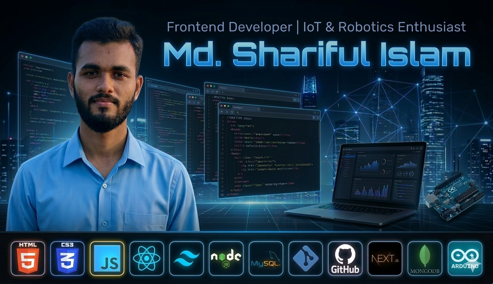

  

<h1 align="center">
Hi 👋 I'm 

Md. Shariful Islam

</h1>

  

<table align="center" width="100%" style="max-width:900px;">
<tr>

<td align="center" width="45%">

<strong>Frontend Developer</strong> &  
<strong>IoT & Robotics Engineering</strong> student from Bangladesh.

Building responsive web apps • connecting code to physical world.

</td>

<td align="center" width="55%">

</td>

</tr>
</table>

<h2 style="background-color:#f1640d;color:#f9efdf;padding:6px 12px;border:3px solid gray;border-radius:6px;display:inline-block;border-top-left-radius:30px;border-bottom-right-radius:30px;">
Tech Stack
</h2>

<h2 style="background-color:#f1640d;color:#f9efdf;padding:6px 12px;border:3px solid gray;border-radius:6px;display:inline-block;border-top-left-radius:30px;border-bottom-right-radius:30px;">
GitHub Stats
</h2>

<h2 style="background-color:#f1640d;color:#f9efdf;padding:6px 12px;border:3px solid gray;border-radius:6px;display:inline-block;border-top-left-radius:30px;border-bottom-right-radius:30px;">
Featured Projects
</h2>

<table align="center" width="85%" style="border-collapse:collapse;">

<tr style="background:#161b22;color:#c9d1d9;">

<th align="center" style="padding:12px;border:1px solid #30363d;">Project</th>
<th align="center" style="padding:12px;border:1px solid #30363d;">Description</th>
<th align="center" style="padding:12px;border:1px solid #30363d;">Link</th>

</tr>

<tr>

<td align="center" style="padding:12px;border:1px solid #30363d;">🌐 Portfolio Website</td>

<td align="center" style="padding:12px;border:1px solid #30363d;">
Personal developer portfolio built with React + Tailwind
</td>

<td align="center" style="padding:12px;border:1px solid #30363d;">

</td>

</tr>

<tr>

<td align="center" style="padding:12px;border:1px solid #30363d;">📝 React To-Do App</td>

<td align="center" style="padding:12px;border:1px solid #30363d;">
Modern task manager with local storage
</td>

<td align="center" style="padding:12px;border:1px solid #30363d;">

</td>

</tr>

<tr>

<td align="center" style="padding:12px;border:1px solid #30363d;">📡 IoT Dashboard</td>

<td align="center" style="padding:12px;border:1px solid #30363d;">
Real-time monitoring with Node.js + MySQL
</td>

<td align="center" style="padding:12px;border:1px solid #30363d;">

</td>

</tr>

<tr>

<td align="center" style="padding:12px;border:1px solid #30363d;">🤖 Robotics Control Panel</td>

<td align="center" style="padding:12px;border:1px solid #30363d;">
Web interface for robot control
</td>

<td align="center" style="padding:12px;border:1px solid #30363d;">

</td>

</tr>

</table>

<h2 style="background-color:#f1640d;color:#f9efdf;padding:6px 12px;border:3px solid gray;border-radius:6px;display:inline-block;border-top-left-radius:30px;border-bottom-right-radius:30px;">
Socials
</h2>

&nbsp;&nbsp;
&nbsp;&nbsp;
&nbsp;&nbsp;
&nbsp;&nbsp;
&nbsp;&nbsp;
&nbsp;&nbsp;

Beautiful web today • Intelligent hardware tomorrow — Md Shariful Islam

Dhaka, Bangladesh • 2026

